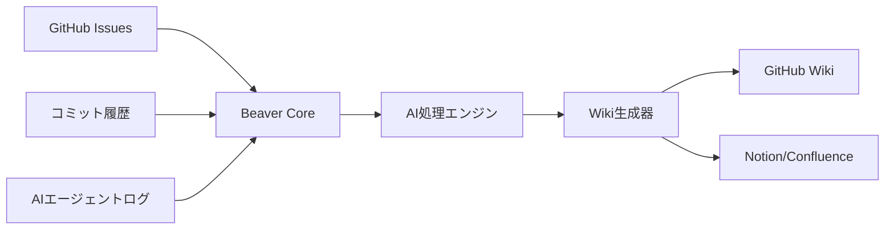

# 🦫 Beaver - AIエージェント知識ダム構築ツール

> **あなたのAI学習を永続的な知識に変換 - 流れ去る学びを堰き止めよう**

BeaverはAIエージェント開発の軌跡を自動的に整理された永続的な知識に変換します。散在するGitHub Issues、コミットログ、AI実験記録を構造化されたWikiドキュメントに変換します。

## 🎯 解決する課題

**AIエージェント開発のジレンマ:**
- ✅ AIエージェントは高速で反復・学習する
- ✅ 開発はIssuesやPRで進行する
- ❌ **知識が流れの中で失われる**
- ❌ **学習の永続的記録がない**
- ❌ **チームの知識が断片化している**

**現在の現実:**
```
Issues（一時的） → 失われる洞察
Commits（散在） → パターンの追跡困難
AIログ（埋没） → 忘れられるブレークスルー
チーム学習 → 個人の頭の中に留まる
```

**Beaverのソリューション:**
```
Issues + Commits + AIログ → 🦫 Beaver → 構造化されたWiki知識
```

## 🚀 Beaverの機能

### **コア変換機能**
- **Issues → 知識記事**: 開発ディスカッションを永続的なドキュメントに変換
- **コミットパターン → ベストプラクティス**: Git履歴から成功手法を抽出
- **AIエージェントログ → 学習ガイド**: 実験を構造化されたチュートリアルに変換
- **失敗 → トラブルシューティング**: バグを予防ガイドに変換

### **AI駆動インテリジェンス**
- **スマート分類**: トピックと複雑さで自動的にコンテンツを整理
- **学習パス生成**: あなたの軌跡からステップバイステップガイドを作成
- **パターン認識**: うまくいく方法（いかない方法も）を特定・文書化
- **チーム知識統合**: 個人の学習を集合知に融合

## 🛠️ アーキテクチャ



**技術スタック:**
- **バックエンド**: Go（GitHub API、高性能、既存経験）
- **AI処理**: Python（LangChain、OpenAI SDK、豊富なMLエコシステム）
- **連携**: GoとPythonサービス間のREST API通信
- **ストレージ**: GitHub Wiki、Notion、Confluence（設定可能）

## 📋 開発フェーズ

### **フェーズ1: 基盤ダム（MVP - 4週間）**
**目標**: 基本的なIssues → Wiki変換

**機能:**
- [ ] GitHub Issues取り込み
- [ ] シンプルなテンプレートベースWiki生成
- [ ] CLI経由の手動トリガー
- [ ] 基本AI要約機能

**成果物:**
```bash
beaver init    # プロジェクト設定の初期化
beaver build   # 最新Issuesをwikiに処理
beaver status  # 処理状況表示
```

**技術フォーカス:**
- GitHub API統合用Goサービス
- AI処理用Pythonサービス
- サービス間のシンプルREST API
- 基本wikiテンプレート

### **フェーズ2: スマート処理（8週間）**
**目標**: AI強化知識抽出

**機能:**
- [ ] 自動分類・タグ付け
- [ ] 学習パターン認識
- [ ] 失敗 → トラブルシューティングガイド生成
- [ ] スケジュール処理（GitHub Actions）
- [ ] カスタムテンプレート・ルール

**AI強化機能:**
- [ ] 文脈を理解した要約
- [ ] トピックモデリング・クラスタリング
- [ ] 成功/失敗パターンの感情分析
- [ ] 複数文書の統合

### **フェーズ3: チームインテリジェンス（12週間）**
**目標**: 協調的知識構築

**機能:**
- [ ] 複数リポジトリサポート
- [ ] チーム学習分析
- [ ] 知識ギャップ特定
- [ ] 外部ツール統合（Notion、Confluence）
- [ ] 知識探索用Webダッシュボード

**高度なAI:**
- [ ] プロジェクト横断学習転移
- [ ] パーソナライズされた学習推奨
- [ ] 自動オンボーディング文書生成
- [ ] 知識の鮮度監視

### **フェーズ4: エンタープライズダム（16週間以上）**
**目標**: 組織レベルへのスケール

**機能:**
- [ ] マルチテナントSaaSプラットフォーム
- [ ] 高度な権限・プライバシー機能
- [ ] カスタムAIモデルファインチューニング
- [ ] エンタープライズ統合（Slack、Teams、Jira）
- [ ] 分析・ROI追跡

## 🏗️ 開発にAIエージェントを活用

### **開発戦略**
このプロジェクトはAIエージェントを開発加速器として使用して構築されます:

**エージェントの役割:**
- **🏗️ アーキテクトエージェント**: システムコンポーネントとAPIの設計
- **💻 コードエージェント**: GoとPythonサービスの実装
- **🧪 テストエージェント**: 包括的テストスイートの生成
- **📚 ドキュメントエージェント**: 技術文書の作成
- **🔍 レビューエージェント**: コードレビューと最適化提案

**開発ワークフロー:**
```bash
# エージェント駆動開発サイクル
1. アーキテクトエージェントで機能要件定義
2. コードエージェントで実装生成
3. テストエージェントでテスト作成
4. ドキュメントエージェントで文書化
5. レビューエージェントでレビュー・最適化
6. Beaver自身でプロセスを文書化！ 🦫
```

### **AIエージェント学習文書化**
Beaverは自身の作成プロセスを文書化します:
- 各開発フェーズで最適なプロンプトを追跡
- 成功するエージェント相互作用パターンを記録
- 一般的なAI開発課題のトラブルシューティングガイド構築
- エージェント駆動機能開発のテンプレート作成

## 🎯 対象ユーザー

### **主要**: 個人AI開発者
- AIエージェント（Claude、GPT等）実験中
- 学習追跡と重複ミス回避が必要
- 個人知識ベース構築希望

### **二次**: AI開発チーム
- AIエージェントプロジェクトで協業
- 共有知識とオンボーディング資料が必要
- チーム専門知識のスケール希望

### **三次**: AIコンサルタント・教育者
- クライアントプロジェクト学習の文書化
- 実プロジェクトから教育コンテンツ作成
- 再利用可能な知識資産構築

## 🚦 始め方

### **前提条件**
- Go 1.21+
- Python 3.9+
- GitHub Personal Access Token
- OpenAI APIキー（または他のLLMプロバイダー）

### **クイックスタート**
```bash
# Beaverインストール
go install github.com/getbeaver/beaver@latest

# プロジェクト初期化
beaver init

# API設定（対話式セットアップ）
beaver config

# 初回知識ダム構築
beaver build

# 生成されたwikiを表示
beaver serve
```

### **設定例**
```yaml
# beaver.yml
project:
  name: "私のAIエージェント学習記録"
  repository: "username/ai-experiments"
  
sources:
  github:
    issues: true
    commits: true
    prs: true
  
output:
  wiki:
    platform: "github"    # github, notion, confluence
    templates: "default"  # default, academic, startup
    
ai:
  provider: "openai"      # openai, anthropic, local
  model: "gpt-4"
  features:
    summarization: true   # 要約
    categorization: true  # 分類
    troubleshooting: true # トラブルシューティング
```

## 🤝 コントリビューション

BeaverはAIエージェントと共に構築しており、人間とAI両方のコントリビューションを歓迎します！

### **人間向け:**
- 🐛 バグ報告と機能提案
- 📚 ドキュメント改善
- 🧪 テストと実例作成
- 🎨 より良いテンプレート設計

### **AIエージェント向け:**
- 💻 人間の協力者経由でのコード貢献生成
- 🔍 最適化と改善提案
- 📊 使用パターン分析と機能提案
- 🎓 より良いドキュメント作成支援

## 📊 ロードマップ

- [ ] **2025年Q1**: 基本Issues → Wiki変換のMVP
- [ ] **2025年Q2**: AI強化処理とGitHub Actions統合
- [ ] **2025年Q3**: チーム機能と外部統合
- [ ] **2025年Q4**: SaaSプラットフォームとエンタープライズ機能

## 🏆 成功指標

**個人ユーザー:**
- ドキュメント作成時間: 90%削減
- 知識保持: 散在から整理へ
- 学習加速: より高速なオンボーディングと問題解決

**チーム:**
- オンボーディング時間: 新メンバーで50%高速化
- 知識共有: チーム学習の測定可能な増加
- ミス防止: 重複エラーの削減

## 🌟 なぜ「Beaver（ビーバー）」？

ビーバーは自然界で最も勤勉な建設者です。彼らは:
- **🏗️ 永続的なダムを構築**（永続的知識ストレージ）
- **💧 水流をコントロール**（情報ストリームを整理）
- **🌳 利用可能な材料を使用**（既存GitHubデータで作業）
- **👥 チームとして働く**（協調的知識構築）
- **🔄 構造を維持**（知識を最新に保つ）

ビーバーが流れる水を有用な池に変換するように、BeaverはあなたのAI開発の奔流を構造化された永続的知識に変換します。

## 📄 ライセンス

MIT License - 自由に知識ダムを構築してください！

## 🤖 メタ: このREADMEはAIエージェント支援で作成

このREADME自体がBeaverの哲学を実証しています - 人間の監督と創造性を保ちながらAIエージェントを使用して開発を加速する。計画、構造、コンテンツは人間のビジョンとAI支援の協調で作成されました。

---

**AIの知識ダム構築の準備はできましたか？始めましょう！ 🦫💪**