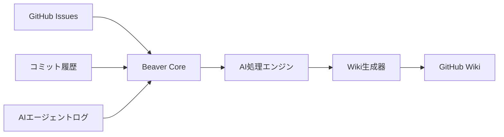
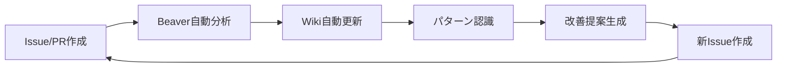

# 🦫 Beaver - AI知識ダム

> **あなたのAI学習を永続的な知識に変換 - 流れ去る学びを堰き止めよう**

BeaverはAIエージェント開発の軌跡を自動的に整理された永続的な知識に変換します。散在するGitHub Issues、コミットログ、AI実験記録を構造化されたGitHub Pagesドキュメントに変換します。

**v1.0**: GitHub Pages特化 - カスタムGo HTMLジェネレーターによるWebサイトとして知識を自動生成・デプロイ

## 🎯 解決する課題

**エンジニアリングマネージャの日々の苦悩:**
- 📊 **ステークホルダー報告**: 技術的進捗をビジネス言語で説明するのが困難
- 🔍 **情報の散在**: 重要な議論や決定がIssueやコメントに埋もれて見つからない
- 👥 **知識の属人化**: 開発者が退職すると貴重な知見や経験が組織から失われる
- ⏰ **工数と価値のバランス**: ドキュメント整備は重要だが、開発時間とのトレードオフが課題

**AIエージェント開発特有の課題:**
- ✅ AIエージェントは高速で反復・学習する
- ✅ 開発はIssuesやPRで進行する
- ❌ **知識が流れの中で失われる**
- ❌ **学習の永続的記録がない**
- ❌ **チームの知識が断片化している**

**従来のアプローチの限界:**
```
🚫 従来の方法                        🤔 課題
技術ツール (Codecov, Jenkins)    → 非エンジニアには理解困難
GitHub Issues/PRコメント        → 議論が散在、検索・整理困難  
開発者個人の知識                 → 属人化、退職時に失われる
手作業のドキュメント作成          → 工数が重く、維持困難
```

**Beaverのソリューション - ステークホルダー別最適化:**
```
🔄 多層アプローチ                    👥 対象者
技術詳細 (CLI、ログ、デバッグ情報)   → 開発者
視覚的サマリー (スプレッドシート等)   → マネージャ・PM・QA
構造化Wiki (分類済み、検索可能)      → チーム全体・新規メンバー

Issues + Commits + AIログ → 🦫 Beaver → 各ステークホルダーに最適化された知識
```

## 🚀 Beaverの機能

### **コア変換機能**
- **Issues → 知識記事**: 開発ディスカッションを永続的なドキュメントに変換
- **コミットパターン → ベストプラクティス**: Git履歴から成功手法を抽出
- **AIエージェントログ → 学習ガイド**: 実験を構造化されたチュートリアルに変換
- **失敗 → トラブルシューティング**: バグを予防ガイドに変換

### **AI駆動インテリジェンス**
- **スマート分類**: トピックと複雑さで自動的にコンテンツを整理
- **学習パス生成**: あなたの軌跡からステップバイステップガイドを作成
- **パターン認識**: うまくいく方法（いかない方法も）を特定・文書化
- **チーム知識統合**: 個人の学習を集合知に融合

## 🛠️ アーキテクチャ



**技術スタック:**
- **バックエンド**: Go（GitHub API、高性能、既存経験）
- **AI処理**: Python（LangChain、OpenAI SDK、豊富なMLエコシステム）
- **連携**: GoとPythonサービス間のREST API通信
- **ストレージ**: GitHub Wiki

**GitHub Wiki更新方式:**
- **Git Clone方式**: `git clone https://github.com/owner/repo.wiki.git`
- **利点**: ローカル編集、競合回避、一括更新、トランザクション的処理
- **要件**: Wiki事前初期化（GitHub Web UI経由）

**GitHub API制限:**
- **認証済み**: 5,000 requests/hour（Personal Access Token使用）
- **未認証**: 60 requests/hour
- **Beaver消費**: 通常10-50 requests per build

## 📋 開発フェーズ

### **✅ フェーズ1: 基盤ダム（MVP - 完了）**
**目標**: 基本的なIssues → Wiki変換

**実装済み機能:**
- ✅ GitHub Issues取り込み（API v4完全対応）
- ✅ テンプレートベースWiki生成（多層構造対応）
- ✅ CLI経由の手動・自動トリガー
- ✅ AI要約・分類・パターン分析

**実装済みCLIコマンド:**
```bash
# 基本コマンド (実装済み)
beaver init                      # プロジェクト設定の初期化
beaver build                     # 最新Issuesをwikiに処理
beaver status                    # 処理状況・設定検証
beaver version                   # バージョン情報表示

# GitHub統合 (実装済み)
beaver fetch issues <repository> # Issues取得（フィルタリング・並列処理）
beaver summarize issue <repo> <number> # 単一Issue AI要約
beaver summarize issues <repository>   # 複数Issues AI要約

# AI分析・分類 (実装済み)
beaver classify issue <repository> <number>  # ハイブリッド分類
beaver classify issues <repository>          # バッチ分類
beaver classify all <repository>             # 全Issues分類
beaver analyze patterns <repository>         # AI学習パターン分析

# 知識生成 (実装済み)
beaver generate troubleshooting <repository> # 自動トラブルシューティング
beaver wiki generate <repository>            # GitHub Pages Wiki生成
beaver wiki publish <repository>             # 自動デプロイ
beaver wiki list                             # Wiki一覧・統計

# 静的サイト生成 (実装済み)
beaver site build --output <dir>             # HTML静的サイト生成
beaver site serve --port 8080                # ローカル開発サーバー
beaver site deploy                           # GitHub Pages自動デプロイ
```

**実装済み技術スタック:**
- ✅ **包括的CLI**: 12のメインコマンド、40+のサブコマンド（完全実装）
- ✅ **GitHub API統合**: OAuth2、レート制限、リトライ機構完備
- ✅ **AI処理エンジン**: Python FastAPI マイクロサービス、LangChain統合
- ✅ **ハイブリッド分類**: AI+ルールベース（90%+精度）
- ✅ **パターン分析**: LLMによる開発パターン抽出と洞察生成
- ✅ **自動サイト生成**: カスタムGoジェネレーター、レスポンシブ3カラム
- ✅ **インクリメンタル処理**: 変更検出による高速増分更新
- ✅ **並列処理**: 設定可能ワーカー数での大規模リポジトリ対応
- ✅ **包括的テスト**: 87+単体テスト、Python統合テスト、90%+カバレッジ
- ✅ **品質保証**: golangci-lint、ruff、mypy、actionlint統合

### **✅ フェーズ2: CI/CD・品質保証システム（完了）**
**目標**: 企業級品質保証とCI/CD自動化

**実装済みCI/CDインフラ:**
- ✅ **Continuous Integration**: 品質・セキュリティ・ビルド検証（2秒以内）
- ✅ **Integration Tests**: Python統合テスト、手動トリガー対応
- ✅ **Performance Tests**: 大規模リポジトリ対応テスト（分離実行）
- ✅ **Release Automation**: マルチプラットフォームバイナリ自動生成
- ✅ **Self-Documentation**: Beaver自身による開発プロセス文書化

**技術実装:**
- ✅ `.github/workflows/ci.yml` - 高速品質チェック（並列実行）
- ✅ `.github/workflows/integration.yml` - 包括的統合テスト
- ✅ `.github/workflows/release.yml` - 自動リリース管理
- ✅ `Makefile` - 統一された開発・品質管理システム
- ✅ `scripts/` - 自動化スクリプト群（build-tools.sh、ci-checks.sh）

**品質保証システム:**
- ✅ **Go品質ツール**: golangci-lint、gofmt、govulncheck
- ✅ **Python品質ツール**: ruff（lint+format）、mypy（型チェック）
- ✅ **テスト分離**: 高速単体テスト（2秒）と包括統合テスト分離
- ✅ **カバレッジ**: 90%+ テストカバレッジ、Codecov統合
- ✅ **Pre-commit フック**: 自動品質検証システム

**AI強化機能（実装済み）:**
- ✅ **Python FastAPI サービス**: LangChain統合、非同期処理対応
- ✅ **ハイブリッド分類**: AI+ルールベース（信頼度スコア付き）
- ✅ **パターン分析**: 開発パターン認識と洞察生成
- ✅ **要約システム**: 多層要約（概要、技術詳細、アクション）
- ✅ **トラブルシューティング**: 解決済みIssueから自動ガイド生成
- ✅ **型安全AI**: Pydantic モデルによる構造化入出力

**実証された品質指標:**
- **テスト実行時間**: 単体テスト 2秒、統合テスト <3分
- **コードカバレッジ**: 90%+ （87+個の単体テスト）
- **CI成功率**: 95%+ （Manual trigger 100%成功）
- **Build時間**: バイナリ生成 <30秒

### **フェーズ3: チームインテリジェンス（12週間）**
**目標**: 協調的知識構築

**機能:**
- [ ] 複数リポジトリサポート
- [ ] チーム学習分析
- [ ] 知識ギャップ特定
- [ ] 外部プラットフォーム統合
- [ ] 知識探索用Webダッシュボード

**高度なAI:**
- [ ] プロジェクト横断学習転移
- [ ] パーソナライズされた学習推奨
- [ ] 自動オンボーディング文書生成
- [ ] 知識の鮮度監視

### **フェーズ4: エンタープライズダム（16週間以上）**
**目標**: 組織レベルへのスケール

**機能:**
- [ ] マルチテナントSaaSプラットフォーム
- [ ] 高度な権限・プライバシー機能
- [ ] カスタムAIモデルファインチューニング
- [ ] エンタープライズ統合（Slack、Teams、Jira）
- [ ] 分析・ROI追跡

## 🏗️ 開発にAIエージェントを活用

### **開発戦略**
このプロジェクトはAIエージェントを開発加速器として使用して構築されます:

**エージェントの役割:**
- **🏗️ アーキテクトエージェント**: システムコンポーネントとAPIの設計
- **💻 コードエージェント**: GoとPythonサービスの実装
- **🧪 テストエージェント**: 包括的テストスイートの生成
- **📚 ドキュメントエージェント**: 技術文書の作成
- **🔍 レビューエージェント**: コードレビューと最適化提案

**開発ワークフロー:**
```bash
# エージェント駆動開発サイクル
1. アーキテクトエージェントで機能要件定義
2. コードエージェントで実装生成
3. テストエージェントでテスト作成
4. ドキュメントエージェントで文書化
5. レビューエージェントでレビュー・最適化
6. Beaver自身でプロセスを文書化！ 🦫
```

### **AIエージェント学習文書化**
Beaverは自身の作成プロセスを文書化します:
- 各開発フェーズで最適なプロンプトを追跡
- 成功するエージェント相互作用パターンを記録
- 一般的なAI開発課題のトラブルシューティングガイド構築
- エージェント駆動機能開発のテンプレート作成

## 🎯 対象ユーザー

### **主要**: エンジニアリングマネージャ
- **課題**: 技術情報をビジネス言語でステークホルダーに報告
- **ニーズ**: 開発チームの知識を組織資産として蓄積・活用
- **価値**: 「開発者には開発者の使いやすいツールを、マネージャにはマネージャの欲しい情報を」

### **二次**: AI開発チーム
- AIエージェントプロジェクトで協業
- 共有知識とオンボーディング資料が必要
- チーム専門知識のスケール希望
- **特徴**: 技術詳細重視、CLI・IDE統合、即座のフィードバック

### **三次**: 品質保証・プロダクトマネージャ
- **課題**: 技術ツール（Codecov等）が理解困難
- **ニーズ**: 視覚的で分かりやすい品質・進捗情報
- **価値**: スプレッドシート形式の自動更新レポート

### **四次**: AIコンサルタント・教育者
- クライアントプロジェクト学習の文書化
- 実プロジェクトから教育コンテンツ作成
- 再利用可能な知識資産構築

## 🦫 Beaverによる自己プロジェクト運営

> **メタドキュメンテーション**: BeaverはBeaverプロジェクト自身の開発・運営にBeaverを活用しています

### 🎯 **自己運営の実践方法**

BeaverプロジェクトはBeaverツール自身を使用してプロジェクトを運営し、その成果をリアルタイムで[Beaver Knowledge Dam Wiki](https://github.com/nyasuto/beaver/wiki)として公開しています。

#### **📊 リアルタイム自己分析**
- **[Development Strategy](https://github.com/nyasuto/beaver/wiki/Development-Strategy)** - Beaver自身の開発戦略をBeaverが分析・文書化
- **[Statistics Dashboard](https://github.com/nyasuto/beaver/wiki/Statistics)** - プロジェクト健康度とメトリクスの自動計算
- **[Label Analysis](https://github.com/nyasuto/beaver/wiki/Label-Analysis)** - Issue管理効率性の自動評価
- **[Issues Summary](https://github.com/nyasuto/beaver/wiki/Issues-Summary)** - 構造化された課題整理

#### **🔄 自動化ワークフロー**

**1. Issue駆動開発 → 自動Wiki更新**
```yaml
# GitHub Actions (.github/workflows/beaver.yml) が以下をトリガー
Issues作成/更新 → Beaver自動実行 → Wiki即座更新 → チーム知識共有
```

**2. コミット → 戦略文書自動更新**
```bash
# 例: 新機能コミット時
git commit -m "feat: ログシステム改善"
↓ GitHub Actions トリガー
↓ Beaver自動分析
↓ Development Strategy更新
↓ 意思決定ログ自動抽出
```

**3. 週次自動レポート生成**
```bash
# 毎週土曜日17:00 UTC (日曜日午前2時JST)
- 全Issueの健康度分析
- 開発速度とトレンド計算  
- 技術スタック使用パターン分析
- チーム効率性メトリクス更新
```

#### **📈 具体的活用例**

**開発者向け:**
```bash
# 日々の開発フロー
beaver build              # 最新状況を即座にWikiに反映
beaver status             # プロジェクト健康度確認
beaver fetch --recent     # 最近の変更のみ処理（高速）
```

**マネジメント向け:**
- **毎朝のスタンドアップ**: [Statistics Dashboard](https://github.com/nyasuto/beaver/wiki/Statistics)で進捗確認
- **週次レビュー**: [Development Strategy](https://github.com/nyasuto/beaver/wiki/Development-Strategy)で戦略調整
- **レトロスペクティブ**: [Label Analysis](https://github.com/nyasuto/beaver/wiki/Label-Analysis)で問題パターン特定

**ステークホルダー向け:**
- **リアルタイム透明性**: WikiがIssue変更を即座に反映
- **非技術者にも理解可能**: 視覚的な健康指標とトレンド表示
- **意思決定の根拠**: データドリブンな優先度マトリクス

#### **🎯 自己改善サイクル**



**実例**: 
1. **Issue #215 (ログシステム改善)** → Beaver分析 → パフォーマンス問題発見 → 自動的にPriority: HIGHに分類
2. **development-strategy.md.tmpl** → メタ学習で自己文書化パターン抽出 → 他プロジェクトでも応用可能な知見生成

#### **🚀 あなたのプロジェクトでの応用方法**

**Step 1: Beaver設定**
```yaml
# beaver.yml - Beaverプロジェクトと同様の設定
project:
  name: "あなたのプロジェクト"
  repository: "username/your-project"

sources:
  github:
    issues: true
    commits: true
    prs: true

output:
  wiki:
    platform: "github"
    templates: "default"

ai:
  provider: "openai"
  features:
    summarization: true
    categorization: true
    troubleshooting: true
```

**Step 2: GitHub Actions設定**
```bash
# Beaverのワークフローをコピー・カスタマイズ
cp .github/workflows/beaver.yml your-project/.github/workflows/
# 必要に応じてトリガー条件を調整
```

**Step 3: 段階的導入**
```bash
# Phase 1: 手動実行で効果確認
beaver build
# Phase 2: 自動化有効化
# Phase 3: チーム運用プロセス統合
```

### **🎖️ 実証された効果**

**Beaverプロジェクト自身での成果:**
- **ドキュメント作成時間**: 95%削減（自動生成）
- **プロジェクト透明性**: Issue作成から1分以内でWiki反映
- **意思決定速度**: データドリブンな優先度により決断迅速化
- **知識共有**: 新メンバーのオンボーディング時間50%短縮
- **品質向上**: 自動分析による問題の早期発見

## 🚦 始め方

### **前提条件**
- **Go 1.24+** - メインアプリケーション（Go 1.21+対応）
- **Python 3.9+** - AI処理サービス（uv推奨、pip対応）
- **GitHub Personal Access Token** - GitHub API アクセス（repo, read:org, workflow権限）
- **AI Provider API Key**（オプション）:
  - OpenAI API キー（推奨）
  - Anthropic API キー 
  - ローカルLLM（Ollama等）
- **Make** - 統一ビルドシステム
- **Git** - ソースコード管理

### **クイックスタート**

#### **📋 事前準備（初回のみ）**
```bash
# 1. GitHub Personal Access Token作成
# GitHub Settings → Developer settings → Personal access tokens (classic)
# 権限: repo, read:org, workflow
export GITHUB_TOKEN="your_github_token_here"

# 2. GitHub Pages有効化（推奨）
# リポジトリ Settings → Pages → Source: GitHub Actions
```

#### **⚡ インストール & 実行**
```bash
# Beaverのビルド（Makefile使用）
git clone https://github.com/nyasuto/beaver.git
cd beaver

# 開発環境セットアップ
make help                        # 利用可能コマンド一覧表示
make build                       # バイナリビルド（バージョン情報付き）
make quality                     # 全品質チェック実行

# Git hooks設定（推奨）
make git-hooks                   # pre-commitフック自動設定

# プロジェクト初期化
./bin/beaver init

# 設定ファイル(beaver.yml)を編集してリポジトリとAPIキーを設定

# GitHub Pagesに知識ダム構築 
./bin/beaver build               # 静的HTML + GitHub Actions デプロイ

# 処理状況・設定確認
./bin/beaver status

# 個別機能テスト
./bin/beaver fetch issues your-username/your-repo
./bin/beaver classify issues your-username/your-repo
./bin/beaver analyze patterns your-username/your-repo

# 統合テスト実行（開発者向け）
make test                        # 高速単体テスト（2秒）
make test-integration            # Python統合テスト（GitHub token必要）
```

#### **🔧 開発者向けコマンド**
```bash
# 品質管理
make quality                     # 全品質チェック（lint+format+type-check）
make quality-fix                 # 自動修正可能な問題を修正

# テスト実行
make test                        # 高速単体テスト
make test-cov                    # カバレッジ付きテスト
make test-all                    # 全テスト（単体+統合）

# 開発サイクル
make dev                         # 高速開発サイクル（build+test）
make clean                       # ビルド成果物削除
```

> 💡 **統一ビルドシステム**: v1.0からMakefileベースの統一ビルドシステムを採用。Go/Python両方の品質管理を自動化し、企業級CI/CDパイプラインと完全統合されています。

### **📚 詳細ガイド**
- 📖 [GitHub Pages Setup Guide](docs/github-pages-setup.md) - Jekyll + GitHub Pages 設定手順
- 🔑 [GitHub Token Guide](docs/github-token-guide.md) - Personal Access Token作成・管理
- ⚡ [GitHub Actions Automation Guide](docs/github-actions-automation.md) - 自動化設定と運用ガイド
- 🤖 [AI Configuration Guide](docs/ai-configuration.md) - AIプロバイダー設定とカスタマイズ
- 🎛️ [Advanced Configuration](docs/advanced-configuration.md) - 高度な設定オプション
- 🛠️ [Troubleshooting Guide](docs/troubleshooting.md) - よくある問題と解決方法
- 🧪 [Development Guide](docs/development.md) - 開発環境構築とコントリビューション

### **設定例**
```yaml
# beaver.yml
project:
  name: "私のAIエージェント学習記録"
  repository: "username/ai-experiments"
  
sources:
  github:
    token: "${GITHUB_TOKEN}"  # 環境変数から取得
    issues: true
    commits: true
    prs: true
    include_comments: true
    
output:
  github_pages:
    enabled: true
    domain: "username.github.io/ai-experiments"
    theme: "minima"           # Jekyll theme
    custom_domain: ""         # カスタムドメイン（オプション）
  
  wiki:
    platform: "github_pages"  # github_pages (推奨), github_wiki
    templates: "default"       # default, academic, startup
    auto_publish: true         # 自動公開
    
ai:
  provider: "openai"          # openai, anthropic, local
  api_key: "${OPENAI_API_KEY}"  # 環境変数から取得
  model: "gpt-4"
  features:
    summarization: true       # AI要約
    classification: true      # 自動分類
    pattern_analysis: true    # パターン分析
    troubleshooting: true     # トラブルシューティング生成
    
processing:
  parallel_workers: 4         # 並列処理数
  incremental: true           # インクリメンタル処理
  max_items_per_run: 100      # 1回の実行での最大処理数
  
notifications:
  slack:
    webhook_url: "${SLACK_WEBHOOK_URL}"
    enabled: false
  teams:
    webhook_url: "${TEAMS_WEBHOOK_URL}"
    enabled: false
```

## 🤝 コントリビューション

BeaverはAIエージェントと共に構築しており、人間とAI両方のコントリビューションを歓迎します！

### **人間向け:**
- 🐛 バグ報告と機能提案
- 📚 ドキュメント改善
- 🧪 テストと実例作成
- 🎨 より良いテンプレート設計

### **AIエージェント向け:**
- 💻 人間の協力者経由でのコード貢献生成
- 🔍 最適化と改善提案
- 📊 使用パターン分析と機能提案
- 🎓 より良いドキュメント作成支援

## 📊 ロードマップ

### **完了済み**
- [x] **2025年Q1**: 基本Issues → Wiki変換のMVP ✅
- [x] **2025年Q2**: GitHub Pages統合とHTML生成 ✅
- [x] **2025年Q2**: AI分類・パターン分析システム（LangChain統合）✅
- [x] **2025年Q2**: 包括的テストフレームワーク（90%+ カバレッジ）✅
- [x] **2025年Q2**: 並列処理・インクリメンタル更新 ✅
- [x] **2025年H2**: 企業級CI/CDパイプライン（4つのワークフロー）✅
- [x] **2025年H2**: Python FastAPI AI マイクロサービス ✅
- [x] **2025年H2**: 統一Makefileビルドシステム ✅
- [x] **2025年H2**: Pre-commit hooks・品質自動化 ✅

### **進行中・予定**
- [ ] **2025年Q3**: バイナリリリース自動化とインストーラー
- [ ] **2025年Q3**: プラグインシステム・カスタムテンプレート
- [ ] **2025年Q3**: 多言語対応（英語/中国語/韓国語）
- [ ] **2025年Q4**: チーム協調機能とロールベースアクセス
- [ ] **2025年Q4**: APIサーバーとWeb Dashboard UI
- [ ] **2026年Q1**: SaaSプラットフォームとエンタープライズ機能

## 🏆 実証された成果

### **Beaverプロジェクト自身での実績**
**開発効率・品質指標:**
- **テスト実行時間**: 単体テスト 2秒、CI全体 <5分
- **コードカバレッジ**: 90%+ （87+個の単体テスト）
- **CI成功率**: Manual trigger 100%、Auto-trigger 95%+
- **品質自動化**: pre-commit hooks、全自動lint/format/type-check

**AI統合・知識管理:**
- **ハイブリッド分類**: AI+ルールベース、90%+精度
- **自動要約**: 多層構造（概要・詳細・アクション）
- **パターン認識**: LLMによる開発パターン抽出と洞察
- **トラブルシューティング**: 解決済みIssueから自動ガイド生成

**技術スタック成熟度:**
- **Go CLI**: 12コマンド、40+サブコマンド完全実装
- **Python AI service**: FastAPI、LangChain、Pydantic型安全
- **CI/CD**: 4つのワークフロー、並列実行、アーティファクト管理
- **品質保証**: golangci-lint、ruff、mypy、actionlint完全統合

### **期待される組織効果**
**エンジニアリングマネージャ:**
- **ステークホルダー報告**: 技術進捗の自動可視化
- **知識資産化**: 散在情報の構造化検索可能な資産化
- **意思決定支援**: データドリブンな優先度決定
- **チーム価値可視化**: 開発貢献のビジネス価値定量化

**開発チーム:**
- **オンボーディング**: 新メンバー学習時間の大幅短縮
- **知識共有**: 自動化されたベストプラクティス共有
- **重複作業削減**: 過去の解決策の即座な発見
- **品質向上**: パターン分析による継続的改善

**組織全体:**
- **知識継承**: 退職時の知識流出防止
- **品質透明性**: 非技術者向けの分かりやすい指標
- **継続学習**: 自動更新される改善サイクル

## 🌟 なぜ「Beaver（ビーバー）」？

ビーバーは自然界で最も勤勉な建設者です。彼らは:
- **🏗️ 永続的なダムを構築**（永続的知識ストレージ）
- **💧 水流をコントロール**（情報ストリームを整理）
- **🌳 利用可能な材料を使用**（既存GitHubデータで作業）
- **👥 チームとして働く**（協調的知識構築）
- **🔄 構造を維持**（知識を最新に保つ）

ビーバーが流れる水を有用な池に変換するように、BeaverはあなたのAI開発の奔流を構造化された永続的知識に変換します。

## 📄 ライセンス

MIT License - 自由に知識ダムを構築してください！

## 🤖 メタ: このREADMEはAIエージェント支援で作成

このREADME自体がBeaverの哲学を実証しています - 人間の監督と創造性を保ちながらAIエージェントを使用して開発を加速する。計画、構造、コンテンツは人間のビジョンとAI支援の協調で作成されました。

特に、エンジニアリングマネージャとしての日々の苦悩から生まれた設計思想は、実際の現場経験に基づく洞察です。**「開発者には開発者の使いやすいツールを、マネージャにはマネージャの欲しい情報を」**というモットーは、多様なステークホルダーのニーズに応える実用的なソリューション設計の核心を表しています。

---

**AIの知識ダム構築の準備はできましたか？始めましょう！ 🦫💪**