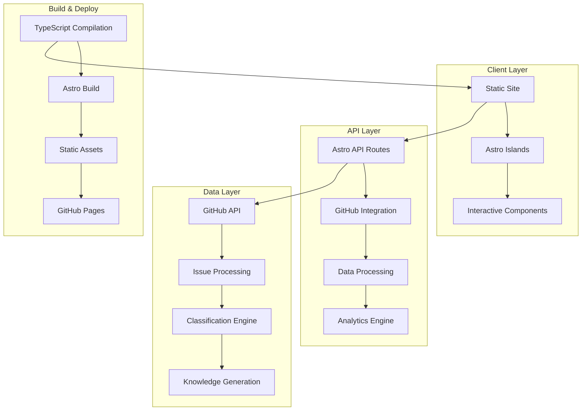

# 🏗️ Beaver Astro + TypeScript Architecture Design

## 🎯 プロジェクト設計概要

### アーキテクチャの柱

1. **AI-First Development**: Claude Code による開発最適化
2. **Type Safety**: TypeScript + Zod による厳密な型安全性
3. **Performance**: Astro の静的生成 + Island Architecture
4. **Modularity**: 独立性の高いコンポーネント設計
5. **Scalability**: 大規模データ・チーム対応

## 📊 システムアーキテクチャ



## 🔧 技術スタック詳細

### Frontend Layer
- **Astro 4.0+**: 静的サイト生成 + ハイブリッドレンダリング
- **TypeScript 5.0+**: 厳密な型チェック
- **Tailwind CSS**: ユーティリティファーストCSS
- **Chart.js**: データ可視化
- **React** (Islands): インタラクティブコンポーネント

### Backend/API Layer
- **Astro API Routes**: サーバーサイドエンドポイント
- **Octokit**: GitHub API統合
- **Zod**: ランタイム型検証
- **date-fns**: 日付操作ユーティリティ

### Data Processing
- **Issue Classification**: ルールベース + AI分析
- **Markdown Processing**: remark/rehype ecosystem
- **Analytics Engine**: カスタム分析ロジック
- **Knowledge Generation**: 構造化コンテンツ生成

## 📁 詳細ディレクトリ構造

```
beaver-astro/
├── src/
│   ├── components/                 # UIコンポーネント
│   │   ├── ui/                    # 基本UIコンポーネント
│   │   │   ├── Button.astro
│   │   │   ├── Card.astro
│   │   │   ├── Input.astro
│   │   │   └── Modal.astro
│   │   ├── charts/                # データ可視化
│   │   │   ├── IssueChart.tsx     # React Island
│   │   │   ├── TrendChart.tsx
│   │   │   └── DistributionChart.tsx
│   │   ├── navigation/            # ナビゲーション
│   │   │   ├── Header.astro
│   │   │   ├── Sidebar.astro
│   │   │   └── Breadcrumb.astro
│   │   ├── layouts/               # レイアウト
│   │   │   ├── BaseLayout.astro
│   │   │   ├── PageLayout.astro
│   │   │   └── DashboardLayout.astro
│   │   └── examples/              # サンプルコンポーネント
│   │
│   ├── pages/                     # ページルーティング
│   │   ├── index.astro            # ホームページ
│   │   ├── issues/                # Issues関連ページ
│   │   │   ├── index.astro        # Issues一覧
│   │   │   ├── [id].astro         # Individual Issue
│   │   │   └── categories/        # カテゴリ別ページ
│   │   ├── analytics/             # 分析ダッシュボード
│   │   │   ├── index.astro        # メインダッシュボード
│   │   │   ├── trends.astro       # トレンド分析
│   │   │   └── contributors.astro # 貢献者分析
│   │   └── api/                   # API エンドポイント
│   │       ├── issues.ts          # Issues API
│   │       ├── analytics.ts       # Analytics API
│   │       └── github/
│   │           ├── auth.ts        # GitHub認証
│   │           └── webhooks.ts    # Webhook処理
│   │
│   ├── lib/                       # コアライブラリ
│   │   ├── github/                # GitHub統合
│   │   │   ├── client.ts          # GitHub API クライアント
│   │   │   ├── issues.ts          # Issues処理
│   │   │   ├── auth.ts            # 認証処理
│   │   │   └── types.ts           # GitHub型定義
│   │   ├── types/                 # TypeScript型定義
│   │   │   ├── global.ts          # グローバル型
│   │   │   ├── api.ts             # API型定義
│   │   │   ├── components.ts      # コンポーネント型
│   │   │   └── config.ts          # 設定型
│   │   ├── schemas/               # Zod検証スキーマ
│   │   │   ├── github.ts          # GitHub データスキーマ
│   │   │   ├── config.ts          # 設定スキーマ
│   │   │   ├── api.ts             # API スキーマ
│   │   │   └── validation.ts      # 共通検証
│   │   ├── analytics/             # 分析エンジン
│   │   │   ├── classifier.ts      # Issue分類エンジン
│   │   │   ├── trends.ts          # トレンド分析
│   │   │   ├── metrics.ts         # メトリクス計算
│   │   │   └── insights.ts        # インサイト生成
│   │   ├── config/                # 設定管理
│   │   │   ├── loader.ts          # 設定ローダー
│   │   │   ├── validation.ts      # 設定検証
│   │   │   └── defaults.ts        # デフォルト設定
│   │   └── utils/                 # ユーティリティ
│   │       ├── date.ts            # 日付処理
│   │       ├── string.ts          # 文字列処理
│   │       ├── validation.ts      # 検証ヘルパー
│   │       ├── cache.ts           # キャッシュ機能
│   │       └── logger.ts          # ログ機能
│   │
│   ├── styles/                    # スタイル定義
│   │   ├── global.css             # グローバルスタイル
│   │   ├── components.css         # コンポーネントスタイル
│   │   └── utilities.css          # カスタムユーティリティ
│   │
│   └── data/                      # 静的データ
│       ├── categories.json        # カテゴリ定義
│       ├── templates/             # テンプレート
│       └── examples/              # サンプルデータ
│
├── public/                        # 静的アセット
│   ├── images/
│   ├── icons/
│   └── favicon.ico
│
├── config/                        # プロジェクト設定
│   ├── beaver.config.ts           # メイン設定
│   ├── classification-rules.yaml  # 分類ルール
│   ├── category-mapping.json      # カテゴリマッピング
│   └── deployment.yaml            # デプロイ設定
│
├── scripts/                       # ビルド・デプロイスクリプト
│   ├── build.ts                   # ビルドスクリプト
│   ├── deploy.ts                  # デプロイスクリプト
│   ├── fetch-data.ts              # データ取得
│   └── generate-types.ts          # 型生成
│
├── docs/                          # ドキュメント
│   ├── api/                       # API ドキュメント
│   ├── components/                # コンポーネントガイド
│   ├── deployment/                # デプロイガイド
│   └── development/               # 開発ガイド
│
├── __tests__/                     # テスト
│   ├── unit/                      # ユニットテスト
│   ├── integration/               # 統合テスト
│   ├── e2e/                       # E2Eテスト
│   └── __mocks__/                 # モックデータ
│
├── .github/                       # GitHub設定
│   ├── workflows/                 # GitHub Actions
│   │   ├── ci.yml                 # CI/CD
│   │   ├── deploy.yml             # デプロイ
│   │   └── tests.yml              # テスト実行
│   └── ISSUE_TEMPLATE/            # Issue テンプレート
│
├── astro.config.mjs               # Astro設定
├── tailwind.config.mjs            # Tailwind設定
├── tsconfig.json                  # TypeScript設定
├── package.json                   # プロジェクト設定
├── vitest.config.ts               # テスト設定
├── .env.example                   # 環境変数テンプレート
├── README.md                      # プロジェクト説明
└── CLAUDE.md                      # AI Agent ガイド
```

## 🔄 データフロー設計

### 1. GitHub Issues 取得フロー
```typescript
GitHub API → Octokit Client → Issue Schema Validation → 
Issue Processing → Classification → Knowledge Generation → 
Static Site Build → Deployment
```

### 2. リアルタイム分析フロー
```typescript
User Request → API Route → GitHub Data Fetch → 
Analytics Processing → Chart Data Generation → 
Client-side Rendering (Island)
```

### 3. 設定管理フロー
```typescript
Config Files → Schema Validation → Type-safe Config → 
Build-time Injection → Runtime Access
```

## 🎨 コンポーネント設計原則

### 1. Astro Components (Static)
- サーバーサイドレンダリング
- Zero JavaScript by default
- Props validation with Zod
- Scoped styling

### 2. React Islands (Interactive)
- クライアントサイドハイドレーション
- 状態管理 (useState, useReducer)
- イベントハンドリング
- データ可視化

### 3. Layout Components
- 共通レイアウト構造
- SEO meta data 管理
- Navigation state
- Theme management

## 📊 パフォーマンス最適化戦略

### 1. Build Time Optimization
- **Static Generation**: 可能な限り静的生成
- **Code Splitting**: Automatic by Astro
- **Tree Shaking**: 未使用コード除去
- **Image Optimization**: Sharp による最適化

### 2. Runtime Optimization
- **Island Hydration**: 必要最小限のJS
- **Lazy Loading**: Components and Images
- **Caching Strategy**: API responses
- **Bundle Size**: <200KB target

### 3. SEO & Accessibility
- **Static HTML**: Search engine friendly
- **Meta Tags**: Dynamic generation
- **Structured Data**: JSON-LD
- **WCAG Compliance**: A11y guidelines

## 🔐 セキュリティ考慮事項

### 1. API Security
- **Environment Variables**: Sensitive data protection
- **Rate Limiting**: GitHub API limits
- **Input Validation**: Zod schemas
- **Error Handling**: Safe error responses

### 2. Client Security
- **CSP Headers**: Content Security Policy
- **XSS Protection**: Sanitization
- **CSRF Protection**: Token validation
- **Dependency Security**: Regular updates

## 🚀 デプロイメント戦略

### 1. GitHub Pages (Primary)
- **Static Site**: Perfect fit for GitHub Pages
- **Actions Integration**: Automated deployment
- **Custom Domain**: Optional
- **SSL/TLS**: Automatic

### 2. Alternative Platforms
- **Vercel**: Edge functions + CDN
- **Netlify**: Build plugins + Forms
- **Cloudflare Pages**: Global CDN
- **AWS S3/CloudFront**: Enterprise option

## 📈 スケーラビリティ考慮事項

### 1. Data Scaling
- **Incremental Builds**: Only changed content
- **Pagination**: Large issue lists
- **Caching**: API response caching
- **CDN**: Global content delivery

### 2. Team Scaling
- **Multi-repo Support**: Organization-wide
- **Permission Management**: GitHub-based
- **Collaboration Features**: Shared analytics
- **Custom Branding**: Per-organization themes

## 🧪 テスト戦略

### 1. Unit Testing
- **Components**: Render testing
- **Functions**: Logic testing
- **API**: Mock responses
- **Schemas**: Validation testing

### 2. Integration Testing
- **API Routes**: End-to-end API testing
- **GitHub Integration**: Mock GitHub API
- **Build Process**: Full build testing
- **Performance**: Bundle size, speed

### 3. E2E Testing
- **User Flows**: Complete workflows
- **Cross-browser**: Major browsers
- **Mobile**: Responsive testing
- **Accessibility**: A11y testing

---

**この設計により、AI Agent による効率的な開発と高品質な知識管理システムの両立を実現します。**