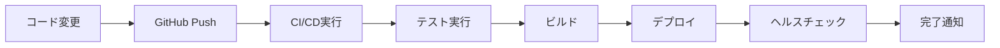

# 🚀 デプロイメントガイド

Beaverを様々なプラットフォームにデプロイする方法について説明します。

## 🎯 デプロイメント戦略概要

Beaverは静的サイトジェネレーターとして設計されており、以下のプラットフォームでデプロイ可能です：

- **GitHub Pages** (推奨) - 自動デプロイメント
- **Vercel** - エッジ機能 + CDN
- **Netlify** - ビルドプラグイン + フォーム
- **Cloudflare Pages** - グローバルCDN
- **AWS S3/CloudFront** - エンタープライズオプション

## 🏠 GitHub Pages (推奨)

### 自動デプロイ設定

**`.github/workflows/deploy.yml`**

```yaml
name: Deploy to GitHub Pages

on:
  push:
    branches: [main]
  workflow_dispatch:

jobs:
  deploy:
    runs-on: ubuntu-latest
    permissions:
      contents: read
      pages: write
      id-token: write
      
    environment:
      name: github-pages
      url: ${{ steps.deployment.outputs.page_url }}
      
    steps:
      - name: Checkout
        uses: actions/checkout@v4
        
      - name: Setup Node.js
        uses: actions/setup-node@v4
        with:
          node-version: '18'
          cache: 'npm'
          
      - name: Install dependencies
        run: npm ci
        
      - name: Build site
        run: npm run build
        env:
          GITHUB_TOKEN: ${{ secrets.GITHUB_TOKEN }}
          CODECOV_TOKEN: ${{ secrets.CODECOV_TOKEN }}
          
      - name: Upload artifact
        uses: actions/upload-pages-artifact@v3
        with:
          path: './dist'
          
      - name: Deploy to GitHub Pages
        id: deployment
        uses: actions/deploy-pages@v4
```

### GitHub Pages設定

1. **Repository Settings → Pages**
2. **Source: GitHub Actions** を選択
3. **Build and deployment: GitHub Actions** を選択

### 環境変数設定

**Repository Settings → Secrets and variables → Actions**

```bash
# 必須
GITHUB_TOKEN         # 自動的に提供される
CODECOV_TOKEN        # Codecov API token (オプション)

# Repository Variables (パブリック設定可能)
PUBLIC_SITE_URL      # https://username.github.io/repository-name
PUBLIC_REPOSITORY    # username/repository-name
```

### 手動デプロイ

```bash
# GitHub Pages 手動デプロイ
npm run deploy:github

# 詳細ステップ
npm run build
npm run deploy:manual
```

## ☁️ Vercel

### 自動デプロイ

1. **Vercel Dashboard** でリポジトリ接続
2. **Build Settings** を設定:
   - Framework Preset: **Astro**
   - Build Command: `npm run build`
   - Output Directory: `dist`

### `vercel.json` 設定

```json
{
  "buildCommand": "npm run build",
  "outputDirectory": "dist",
  "framework": "astro",
  "env": {
    "GITHUB_TOKEN": "@github_token",
    "CODECOV_TOKEN": "@codecov_token"
  }
}
```

### 手動デプロイ

```bash
# Vercel CLI インストール
npm i -g vercel

# デプロイ
vercel deploy

# 本番デプロイ
vercel --prod
```

## 🌐 Netlify

### 自動デプロイ

1. **Netlify Dashboard** でリポジトリ接続
2. **Build Settings** を設定:
   - Build command: `npm run build`
   - Publish directory: `dist`

### `netlify.toml` 設定

```toml
[build]
  command = "npm run build"
  publish = "dist"

[build.environment]
  NODE_VERSION = "18"

[[headers]]
  for = "/*"
  [headers.values]
    X-Frame-Options = "DENY"
    X-XSS-Protection = "1; mode=block"
    X-Content-Type-Options = "nosniff"

[[redirects]]
  from = "/_astro/*"
  to = "/_astro/:splat"
  status = 200
```

### 手動デプロイ

```bash
# Netlify CLI インストール
npm i -g netlify-cli

# デプロイ
netlify deploy

# 本番デプロイ
netlify deploy --prod
```

## ⚡ Cloudflare Pages

### 自動デプロイ

1. **Cloudflare Dashboard** → **Pages**
2. **Connect to Git** でリポジトリ接続
3. **Build Settings**:
   - Build command: `npm run build`
   - Build output directory: `dist`
   - Node.js version: `18`

### カスタムドメイン設定

```bash
# Cloudflare Pages でカスタムドメイン設定
# 1. Pages → Custom domains
# 2. ドメイン追加
# 3. DNS設定（自動または手動）
```

## 🏢 AWS S3 + CloudFront

### S3 + CloudFront設定

```bash
# AWS CLI を使用したデプロイ
aws s3 sync ./dist s3://your-bucket-name --delete
aws cloudfront create-invalidation --distribution-id YOUR_DISTRIBUTION_ID --paths "/*"
```

### GitHub Actions での AWS デプロイ

```yaml
name: Deploy to AWS

on:
  push:
    branches: [main]

jobs:
  deploy:
    runs-on: ubuntu-latest
    steps:
      - uses: actions/checkout@v4
      - uses: actions/setup-node@v4
        with:
          node-version: '18'
          
      - run: npm ci
      - run: npm run build
      
      - name: Configure AWS credentials
        uses: aws-actions/configure-aws-credentials@v4
        with:
          aws-access-key-id: ${{ secrets.AWS_ACCESS_KEY_ID }}
          aws-secret-access-key: ${{ secrets.AWS_SECRET_ACCESS_KEY }}
          aws-region: us-east-1
          
      - name: Deploy to S3
        run: |
          aws s3 sync ./dist s3://${{ secrets.S3_BUCKET }} --delete
          aws cloudfront create-invalidation --distribution-id ${{ secrets.CLOUDFRONT_DISTRIBUTION_ID }} --paths "/*"
```

## 🔧 デプロイ設定詳細

### 環境別設定

**Development:**
```bash
NODE_ENV=development
PUBLIC_SITE_URL=http://localhost:3000/beaver
BUILD_TARGET=development
```

**Staging:**
```bash
NODE_ENV=staging
PUBLIC_SITE_URL=https://staging.yoursite.com/beaver
BUILD_TARGET=staging
```

**Production:**
```bash
NODE_ENV=production
PUBLIC_SITE_URL=https://yoursite.com/beaver
BUILD_TARGET=production
```

### Build最適化

**`astro.config.mjs`**

```javascript
import { defineConfig } from 'astro/config';

export default defineConfig({
  site: process.env.PUBLIC_SITE_URL,
  base: '/beaver',
  build: {
    assets: 'assets',
    // 最適化設定
    inlineStylesheets: 'auto'
  },
  vite: {
    build: {
      rollupOptions: {
        output: {
          manualChunks: {
            'vendor': ['react', 'react-dom'],
            'charts': ['chart.js']
          }
        }
      }
    }
  }
});
```

### パフォーマンス最適化

```bash
# 最適化されたビルド
npm run build

# バンドルサイズ分析
npm run build:analyze

# プリビューサーバー
npm run preview
```

## 🌍 CDN設定

### Cloudflare設定

```javascript
// cloudflare-pages.config.js
export default {
  // キャッシュ設定
  cache: {
    static: {
      maxAge: 31536000 // 1年
    },
    html: {
      maxAge: 3600 // 1時間
    }
  },
  
  // セキュリティヘッダー
  headers: {
    'X-Frame-Options': 'DENY',
    'X-Content-Type-Options': 'nosniff',
    'Referrer-Policy': 'strict-origin-when-cross-origin'
  }
};
```

## 🔒 セキュリティ設定

### HTTPS設定

```yaml
# すべてのプラットフォームでHTTPS強制
force_ssl: true

# セキュリティヘッダー
headers:
  - key: "Strict-Transport-Security"
    value: "max-age=31536000; includeSubDomains"
  - key: "X-Content-Type-Options"
    value: "nosniff"
  - key: "X-Frame-Options"
    value: "DENY"
```

## 📊 モニタリング

### デプロイ成功監視

```yaml
# GitHub Actions でのデプロイ監視
- name: Check deployment
  run: |
    curl -f ${{ env.PUBLIC_SITE_URL }} || exit 1
    echo "Deployment successful!"
```

### パフォーマンス監視

```javascript
// lighthouse-ci.config.js
module.exports = {
  ci: {
    collect: {
      url: [process.env.PUBLIC_SITE_URL],
      numberOfRuns: 3
    },
    assert: {
      assertions: {
        'categories:performance': ['warn', {minScore: 0.9}],
        'categories:accessibility': ['error', {minScore: 0.9}]
      }
    }
  }
};
```

## 🚨 トラブルシューティング

### よくある問題

**デプロイ失敗:**
```bash
# ログ確認
npm run build 2>&1 | tee build.log

# 依存関係の問題
npm ci --force
npm run build
```

**環境変数設定エラー:**
```bash
# 環境変数確認
echo $GITHUB_TOKEN
echo $PUBLIC_SITE_URL

# デバッグビルド
DEBUG=* npm run build
```

**パス設定問題:**
```javascript
// astro.config.mjs で base パス確認
export default defineConfig({
  base: '/beaver',  // GitHub Pages の場合
  // base: '/',     // カスタムドメインの場合
});
```

## 🔄 継続的デプロイメント

### 自動デプロイフロー



### リリース戦略

```bash
# リリースタグ作成
git tag -a v1.0.0 -m "Release v1.0.0"
git push origin v1.0.0

# 自動リリースノート生成
gh release create v1.0.0 --auto
```