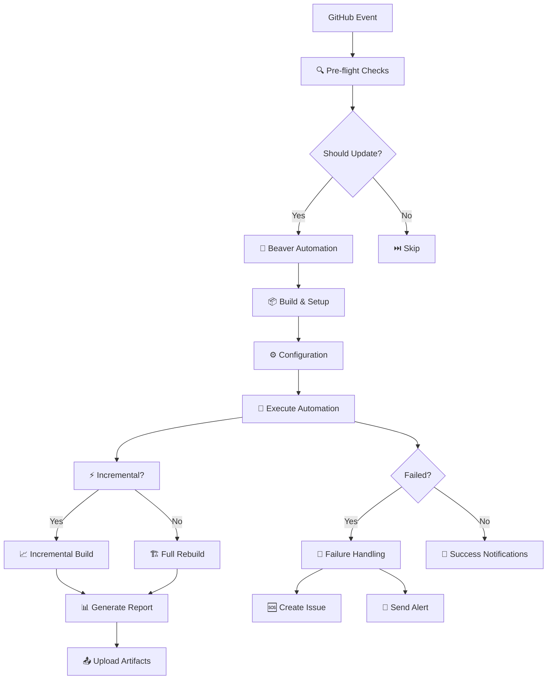

# 🦫 Beaver GitHub Actions Automation Guide

This document provides comprehensive configuration and usage instructions for Beaver's enhanced GitHub Actions automation system (Issue #10 implementation).

## 🎯 Overview

The Beaver GitHub Actions automation provides intelligent, event-driven Wiki updates with incremental processing, notifications, and comprehensive error handling. The system automatically transforms GitHub Issues, PRs, and commits into structured Wiki documentation.

## 🔥 Key Features

- **Event-driven automation**: Responds to issues, PRs, pushes, and scheduled events
- **Incremental updates**: Smart processing that only handles changed content
- **Rich notifications**: Slack and Teams integration with GitHub context
- **Failure recovery**: Automatic issue creation and comprehensive error handling
- **Health monitoring**: Built-in health checks and maintenance automation

## 🚀 Quick Setup

### 1. Prerequisites

- Repository with Wiki enabled (create initial page via GitHub web interface)
- GitHub Personal Access Token with `repo` and `wiki` scopes
- Optional: Slack/Teams webhook URLs for notifications

### 2. Required Secrets

Configure these in your repository's **Settings → Secrets and variables → Actions**:

```yaml
# Required
BEAVER_GITHUB_TOKEN: your_github_token_here  # Fallback: GITHUB_TOKEN

# Optional (for notifications)  
SLACK_WEBHOOK_URL: https://hooks.slack.com/services/...
TEAMS_WEBHOOK_URL: https://outlook.office.com/webhook/...
```

### 3. Repository Configuration

Create or update `beaver.yml` in your repository root:

```yaml
project:
  name: "My AI Project Knowledge"
  repository: "owner/repo"
  
sources:
  github:
    issues: true
    commits: true
    prs: true
  
output:
  wiki:
    platform: "github"
    templates: "default"
    
ai:
  provider: "openai"  # or anthropic, local
  model: "gpt-4"
```

## 📋 Workflow Triggers

### Automatic Triggers

| Event | Trigger | Update Type | Purpose |
|-------|---------|-------------|---------|
| **Issues** | `opened`, `edited`, `closed`, `reopened`, `labeled`, `unlabeled` | Incremental | Real-time issue tracking |
| **Pull Requests** | `closed` (merged only) | Incremental | Code change documentation |
| **Push** | `main` branch | Incremental | Development progress sync |
| **Schedule** | Every Saturday 5 PM UTC | Full rebuild | Weekly maintenance |

### Manual Triggers

Access via **Actions → Beaver Automation → Run workflow**:

```yaml
# Manual trigger options
force_rebuild: true|false        # Force complete rebuild
max_items: "100"                 # Limit processing items  
notify_success: true|false       # Send success notifications
notify_failure: true|false       # Send failure notifications
target_repository: "owner/repo"  # Override target repo
```

## 🔧 Workflow Architecture



## 🔄 Job Descriptions

### 1. Pre-flight Checks (`preflight`)
- **Purpose**: Analyze trigger conditions and determine update strategy
- **Outputs**: `should_update`, `update_type`, `repository`
- **Logic**: 
  - Skips if commit contains `[skip-wiki]`
  - Determines incremental vs full rebuild based on event type
  - Validates repository configuration

### 2. Beaver Automation (`beaver-automation`)
- **Purpose**: Main automation execution with comprehensive setup
- **Features**:
  - Go environment setup with caching
  - Dependency installation and binary build
  - Configuration validation and GitHub connectivity tests
  - Incremental vs full build execution with notification support
  - Detailed automation reporting with state information

### 3. Issue Notification (`issue-notification`)
- **Purpose**: Send specialized notifications for issue events
- **Conditions**: Only runs for issue events with configured webhooks
- **Content**: Issue-specific notifications with action context

### 4. Failure Handling (`failure-notification`)
- **Purpose**: Comprehensive failure recovery and alerting
- **Actions**:
  - Creates detailed GitHub issue with debugging information
  - Sends immediate Slack/Teams failure alerts
  - Provides troubleshooting guidance and quick fixes

### 5. Cleanup (`cleanup`)
- **Purpose**: Maintenance and optimization (scheduled/manual full rebuilds)
- **Tasks**:
  - Artifact cleanup and state optimization
  - Incremental state compression and maintenance
  - System health verification

## 📈 Incremental Updates

### How It Works

The system maintains state in `.beaver/incremental-state.json`:

```json
{
  "last_update": "2025-06-29T12:00:00Z",
  "last_update_sha": "abc123...",
  "processed_issues": {
    "123": "2025-06-29T11:30:00Z",
    "124": "2025-06-29T12:00:00Z"
  },
  "processed_events": [
    {
      "type": "issues",
      "id": "run-123456",
      "timestamp": "2025-06-29T12:00:00Z",
      "metadata": {
        "repository": "owner/repo",
        "actor": "username",
        "workflow": "Beaver Automation"
      }
    }
  ],
  "version": "1.0"
}
```

### Smart Processing Logic

- **Issue Updates**: Reprocesses issues modified since last processing
- **Event Filtering**: Skips duplicate events and unchanged content  
- **Lookback Window**: 24-hour default lookback for safety
- **Max Items**: 100 item default limit for performance
- **State Cleanup**: Automatic old entry removal (30+ days)

### Force Rebuild Triggers

Automatic full rebuilds occur when:
- Scheduled event (weekly)
- Manual trigger with `force_rebuild: true`
- Last update > 7 days ago
- State corruption detected (>10,000 processed issues)

## 🔔 Notifications

### Slack Integration

Rich notifications with GitHub context:

```json
{
  "attachments": [{
    "color": "good",
    "title": "✅ Wiki Update Complete", 
    "title_link": "https://github.com/owner/repo/wiki",
    "text": "インクリメンタルWiki更新完了: 5件のIssueを処理し、3個のページを生成しました",
    "fields": [
      {"title": "Repository", "value": "<https://github.com/owner/repo|owner/repo>", "short": true},
      {"title": "Trigger", "value": "Issue #123 opened", "short": true},
      {"title": "Workflow", "value": "<https://github.com/owner/repo/actions/runs/123|Beaver Automation #45>", "short": true},
      {"title": "Actor", "value": "username", "short": true}
    ],
    "footer": "Beaver Wiki Automation",
    "ts": 1719662530
  }]
}
```

### Teams Integration

Microsoft Teams cards with action buttons:

```json
{
  "@type": "MessageCard",
  "@context": "https://schema.org/extensions", 
  "summary": "Wiki Update Complete",
  "title": "✅ Wiki Update Complete",
  "text": "インクリメンタルWiki更新完了: 5件のIssueを処理し、3個のページを生成しました",
  "sections": [{
    "facts": [
      {"name": "Repository", "value": "owner/repo"},
      {"name": "Trigger", "value": "Issue #123 opened"},
      {"name": "Workflow", "value": "Beaver Automation #45"},
      {"name": "Actor", "value": "username"}
    ]
  }],
  "potentialAction": [
    {"@type": "OpenUri", "name": "View Wiki", "targets": [{"os": "default", "uri": "https://github.com/owner/repo/wiki"}]},
    {"@type": "OpenUri", "name": "View Workflow", "targets": [{"os": "default", "uri": "https://github.com/owner/repo/actions/runs/123"}]}
  ]
}
```

## 🛡️ Security & Permissions

### Required Token Scopes

```yaml
repo:
  - repo:status          # Read repository status
  - repo_deployment      # Read deployments
  - public_repo          # Access public repositories

admin:repo_hook:
  - write:repo_hook      # Manage webhooks (if needed)

metadata:
  - read:repo_hook       # Read repository webhooks
  - read:org             # Read organization info

wiki:
  - wiki                 # Full wiki access (read/write)
```

### Environment Protection

```yaml
# Optional: Configure in Settings → Environments
environment: beaver-automation
protection_rules:
  - required_reviewers: ["@maintainers"]
  - wait_timer: 0
  - prevent_self_review: true
```

### Loop Prevention

- Commits include `[skip-wiki]` marker to prevent recursive triggers
- Pre-flight checks validate commit messages and authors
- State tracking prevents duplicate event processing

## 🧪 Testing & Validation

### Local Testing Script

Use the enhanced CI script for testing:

```bash
# Health check
./scripts/ci-beaver.sh health-check

# Test configuration  
./scripts/ci-beaver.sh test-setup --repository owner/repo --verbose

# Incremental build test
./scripts/ci-beaver.sh incremental --repository owner/repo --dry-run

# Full rebuild test
./scripts/ci-beaver.sh full-rebuild --repository owner/repo --max-items 10

# Notification test
./scripts/ci-beaver.sh notify --repository owner/repo
```

### Manual Workflow Testing

1. **Configuration Test**: Run workflow manually with minimal settings
2. **Incremental Test**: Create/edit an issue, verify incremental processing
3. **Full Rebuild Test**: Use `force_rebuild: true` option
4. **Notification Test**: Verify Slack/Teams notifications with test webhooks
5. **Failure Test**: Intentionally cause failure, verify issue creation

### Integration Testing Checklist

- [ ] Issue events trigger incremental updates
- [ ] PR merge triggers Wiki update
- [ ] Scheduled runs perform full rebuilds  
- [ ] Manual triggers work with all options
- [ ] Notifications deliver to configured channels
- [ ] Failures create GitHub issues with details
- [ ] State persistence works across runs
- [ ] Cleanup jobs maintain optimal performance

## 🚨 Troubleshooting

### Common Issues

#### 1. Token Permission Errors
```bash
# Error: API rate limit exceeded or 403 Forbidden
# Solution: Verify token scopes and regenerate if needed
gh auth refresh --scopes repo,wiki
```

#### 2. Wiki Not Initialized
```bash
# Error: Wiki repository not found
# Solution: Create initial Wiki page via GitHub web interface
# 1. Go to repository → Wiki tab
# 2. Click "Create the first page"  
# 3. Add any content and save
```

#### 3. Build Failures
```yaml
# Check workflow logs for specific errors:
# - Go version compatibility issues
# - Missing dependencies  
# - Configuration validation failures
# - GitHub API connectivity problems
```

#### 4. Incremental State Corruption
```bash
# Reset incremental state
rm -rf .beaver/incremental-state.json

# Force full rebuild
gh workflow run "Beaver Automation" --field force_rebuild=true
```

### Debug Commands

```bash
# Check current automation status
gh run list --workflow="Beaver Automation" --limit 5

# View specific run details  
gh run view RUN_ID --log

# Manual trigger with debug options
gh workflow run "Beaver Automation" \
  --field force_rebuild=false \
  --field max_items=10 \
  --field notify_success=true \
  --field notify_failure=true
```

### Failure Recovery

When the workflow creates a failure issue, it includes:

- **Workflow Context**: Trigger event, action, update type, repository
- **Debug Information**: Run ID, failure time, GitHub context
- **Investigation Steps**: Logs, permissions, state integrity, configuration
- **Quick Fixes**: Rebuild commands, state cleanup, manual triggers

## 📊 Monitoring & Metrics

### Success Indicators

- ✅ Workflow completes without errors (green checkmarks)
- ✅ Wiki pages updated with fresh content 
- ✅ Incremental state properly maintained
- ✅ Notifications delivered successfully
- ✅ Processing time within reasonable limits

### Performance Metrics

Monitor these in workflow logs:

```yaml
Automation Report:
- Trigger: issues.opened
- Update Type: incremental  
- Repository: owner/repo
- Processed Issues: 5 (filtered from 25 total)
- Generated Pages: 3
- Processing Time: 45 seconds
- State File Size: 12KB
```

### Failure Patterns

Common failure types to monitor:

- **Configuration Issues**: Invalid beaver.yml or missing tokens
- **API Limits**: Rate limiting or permission errors
- **Build Failures**: Go compilation or dependency issues  
- **State Corruption**: Incremental state file problems
- **Network Issues**: GitHub API connectivity problems

## 🔄 Maintenance Schedule

### Daily (Automated)
- Incremental updates triggered by repository activity
- Automatic state cleanup for old entries
- Health monitoring via workflow execution

### Weekly (Automated)
- Scheduled full rebuild every Saturday
- Complete state refresh and optimization
- Comprehensive Wiki regeneration

### Monthly (Manual)
- Review automation performance and metrics
- Update token expiration if needed
- Validate notification delivery
- Check for workflow action updates

### Quarterly (Manual)  
- Update workflow dependencies (actions/checkout, actions/setup-go)
- Review and optimize automation logic
- Update documentation for new features
- Conduct integration testing with repository changes

## 🚀 Advanced Configuration

### Custom Event Filtering

Modify workflow triggers for specific needs:

```yaml
# Custom issue filtering
on:
  issues:
    types: [opened, closed]  # Only process opened/closed
  pull_request:
    types: [closed]
    branches: [main, develop]  # Multiple branches
```

### Environment-Specific Settings

```yaml
# Production environment
env:
  GO_VERSION: 'stable'
  BEAVER_CONFIG_FILE: 'beaver.yml'
  BEAVER_LOG_LEVEL: 'info'

# Development environment  
env:
  GO_VERSION: 'latest'
  BEAVER_CONFIG_FILE: 'beaver-dev.yml'
  BEAVER_LOG_LEVEL: 'debug'
```

### Custom Notification Templates

Extend notification content for specific use cases:

```go
// Custom notification fields in pkg/actions/notifications.go
type CustomNotification struct {
    ProjectPhase  string
    TeamMembers   []string
    BusinessValue string
    NextMilestone string
}
```

## 📚 Related Documentation

- [Issue #10](https://github.com/nyasuto/beaver/issues/10) - Original automation requirements
- [PR #200](https://github.com/nyasuto/beaver/pull/200) - Implementation pull request
- [GitHub Token Guide](github-token-guide.md) - Token setup and management
- [Troubleshooting Guide](troubleshooting.md) - General Beaver troubleshooting
- [Wiki Setup Guide](wiki-setup.md) - Manual Wiki configuration

---

## 💡 Best Practices

1. **Start Simple**: Begin with basic configuration and add features incrementally
2. **Test Thoroughly**: Use manual triggers to validate before relying on automatic events
3. **Monitor Actively**: Review workflow logs and Wiki quality regularly  
4. **Keep Tokens Fresh**: Rotate GitHub tokens periodically for security
5. **Document Changes**: Update this guide when modifying workflow configuration

## 🤝 Contributing

To improve the automation system:

1. **Test Changes**: Use forks and manual triggers for validation
2. **Update Documentation**: Keep this guide synchronized with implementation
3. **Report Issues**: Use GitHub issues with `type: ci/cd` label
4. **Share Feedback**: Contribute improvements to notification content and triggers

---

**Ready to automate your knowledge dam? The system is now active and monitoring your repository! 🦫⚡**