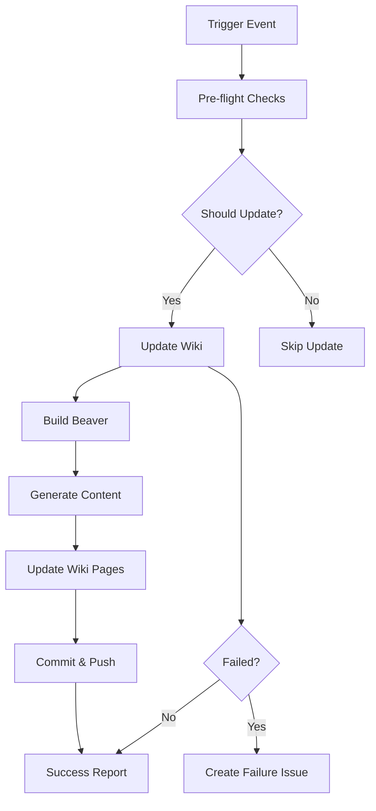

# Wiki Automation Workflow

This document describes the automated Wiki update system implemented for the Beaver project.

## Overview

The Wiki automation workflow automatically updates the project Wiki based on repository activity, ensuring that documentation stays synchronized with development progress.

## Workflow Triggers

The workflow is triggered by the following events:

### 1. Issue Closure (`issues.closed`)
- **When**: An issue is closed
- **Purpose**: Update Wiki with resolved issues and new insights
- **Frequency**: Immediate

### 2. Main Branch Push (`push.main`)
- **When**: Code is pushed to the main branch
- **Purpose**: Sync Wiki with latest code changes
- **Frequency**: On every main branch update

### 3. Scheduled Updates (`schedule`)
- **When**: Every Sunday at 2 AM UTC
- **Purpose**: Weekly maintenance and sync
- **Frequency**: Weekly

### 4. Manual Trigger (`workflow_dispatch`)
- **When**: Manually triggered by maintainers
- **Purpose**: On-demand updates and maintenance
- **Frequency**: As needed

## Workflow Structure



## Jobs

### 1. Pre-flight Checks (`pre-checks`)
- Validates conditions for wiki update
- Checks if wiki repository exists
- Prevents infinite loops from wiki updates

### 2. Update Wiki (`update-wiki`)
- Builds Beaver binary
- Generates wiki content from issues
- Updates wiki repository
- Commits and pushes changes

### 3. Failure Notification (`notify-failure`)
- Creates GitHub issue on workflow failure
- Provides troubleshooting information
- Only runs on actual failures

## Configuration

### Environment Variables
- `GO_VERSION`: Go version for building Beaver
- `BEAVER_CONFIG_FILE`: Configuration file path

### Secrets Required
- `GITHUB_TOKEN`: Must have `repo` and `wiki` scopes

### Repository Variables
The workflow can optionally use these repository variables:
- `BEAVER_TEST_REPO_OWNER`: For testing purposes
- `BEAVER_TEST_REPO_NAME`: For testing purposes

## Manual Triggers

The workflow supports manual triggers with the following options:

### Force Rebuild
```yaml
force_rebuild: true
```
Forces a complete regeneration of all wiki content.

### Target Repository Override
```yaml
target_repository: "owner/repo"
```
Allows updating a different repository's wiki (useful for testing).

## Security Considerations

### Token Permissions
The `GITHUB_TOKEN` must have the following scopes:
- `repo`: To read repository issues and metadata
- `wiki`: To write to the wiki repository

### Loop Prevention
- Commits include `[skip-wiki]` to prevent triggering the workflow
- Pre-flight checks validate commit messages
- Workflow skips if triggered by its own commits

### Environment Protection
- Uses `wiki-automation` environment for sensitive operations
- Requires approval for production wiki updates (configurable)

## Generated Content

### Home Page
- Project overview and status
- Update information and triggers
- Navigation links

### Issues Summary
- Statistics about processed issues
- Recent activity overview
- Categorized issue listings

### Additional Pages
- Generated based on issue content and labels
- Automatically organized by topic
- Cross-referenced with links

## Testing

### Local Testing
Use the provided test script to validate the workflow:

```bash
# Setup test environment
./scripts/test-wiki-workflow.sh --setup

# Test configuration
./scripts/test-wiki-workflow.sh --test-config

# Full workflow test
./scripts/test-wiki-workflow.sh --test-full

# Cleanup
./scripts/test-wiki-workflow.sh --clean
```

### Prerequisites for Testing
- `GITHUB_TOKEN` environment variable
- `jq` command-line tool
- Git repository context

## Troubleshooting

### Common Issues

#### 1. Wiki Not Initialized
**Error**: Wiki repository not found
**Solution**: 
1. Enable wiki in repository settings
2. Create initial wiki page manually
3. Re-run the workflow

#### 2. Permission Denied
**Error**: Token lacks wiki permissions
**Solution**:
1. Update token with `wiki` scope
2. Regenerate token if needed
3. Update repository secrets

#### 3. Build Failures
**Error**: Beaver build fails
**Solution**:
1. Check Go version compatibility
2. Verify dependencies are available
3. Review build logs for specific errors

#### 4. Rate Limiting
**Error**: GitHub API rate limit exceeded
**Solution**:
1. Use authenticated token (higher limits)
2. Implement backoff in workflow
3. Schedule updates during low-usage periods

### Debugging

1. **Check Workflow Logs**: Review the Actions tab for detailed logs
2. **Validate Token**: Ensure token has correct permissions
3. **Test Locally**: Use the test script to reproduce issues
4. **Check Wiki Status**: Verify wiki is enabled and accessible

## Monitoring

### Success Indicators
- ✅ Workflow completes without errors
- ✅ Wiki pages are updated with new content
- ✅ Commit history shows automated updates

### Failure Indicators
- ❌ Workflow fails with error status
- ❌ Automatic issue is created for failure
- ❌ Wiki content becomes stale

### Metrics
- Update frequency and success rate
- Content freshness (time since last update)
- Issue processing coverage

## Maintenance

### Regular Tasks
1. **Weekly**: Review automated updates for quality
2. **Monthly**: Check token expiration and permissions
3. **Quarterly**: Update workflow dependencies and actions

### Updates
When updating the workflow:
1. Test changes in a fork first
2. Use manual triggers to validate
3. Monitor first few automatic runs
4. Update documentation as needed

## Integration with Development Process

### Issue Lifecycle
1. Issue created → No immediate wiki update
2. Issue discussed → Content may be captured in comments
3. Issue closed → Wiki automatically updated with resolution

### Release Process
1. Code merged to main → Wiki updated with changes
2. Release tagged → Wiki includes release information
3. Post-release → Wiki reflects current project state

### Documentation Strategy
- Wiki serves as living documentation
- Issues provide detailed technical discussions
- Wiki extracts and organizes key insights
- Manual documentation supplements automated content

## Future Enhancements

### Planned Features
- AI-enhanced content generation
- Custom templates for different issue types
- Integration with project milestones
- Multi-language support

### Advanced Triggers
- Pull request events
- Release creation
- Milestone completion
- Label-based selective updates

### Content Improvements
- Automatic cross-referencing
- Issue clustering and categorization
- Timeline and progress tracking
- Stakeholder notifications

---

For questions or issues with the wiki automation, please:
1. Check this documentation first
2. Review the workflow logs
3. Test locally with the provided script
4. Create an issue with the `type: ci/cd` label